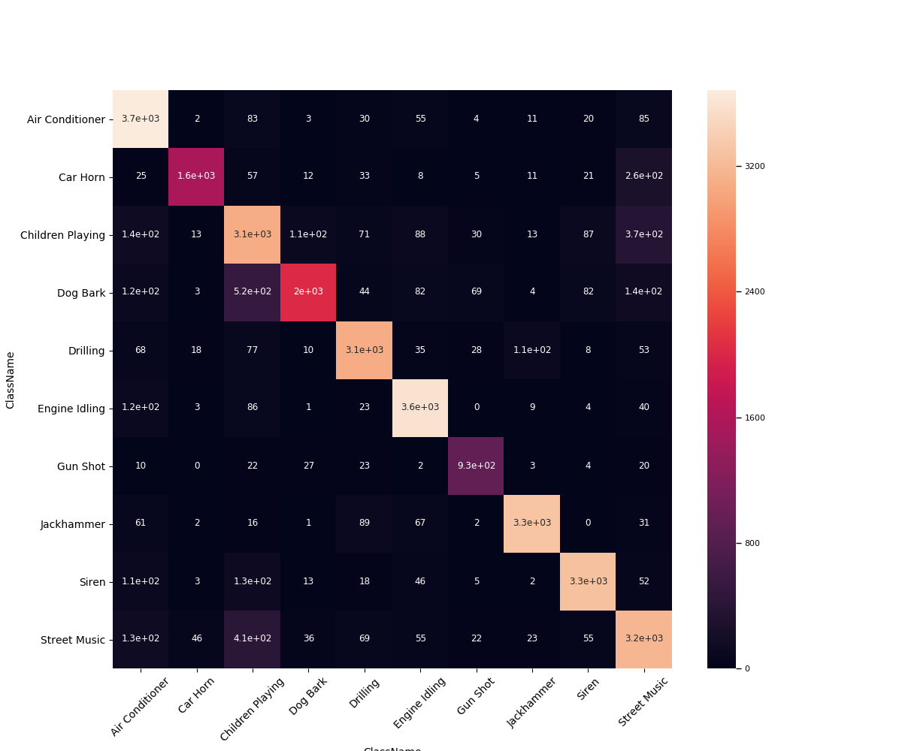

```{r message=FALSE, include=FALSE, warnings=FALSE}
library(knitr)
# make the images flow nicely
knitr::opts_chunk$set(fig.pos = 'H')
```


# Introduction

Vestibulum porttitor massa sed ante luctus, interdum ultrices quam bibendum. Mauris dapibus erat sed ex rutrum tristique. Mauris condimentum luctus enim, nec lobortis massa auctor a. Maecenas finibus nibh eget ipsum dictum, sed efficitur turpis mollis. Nulla venenatis, neque ut commodo pretium, tortor arcu volutpat felis, id condimentum nulla turpis non nisl. Donec accumsan interdum orci id bibendum.
```{r example, out.width = "100%", echo=FALSE, fig.align='center', fig.cap="VGG-16 Architecture"}
 
```

# Problem Statement

Vivamus interdum porttitor tellus at lacinia. Duis vitae tempor neque. Donec vitae pretium justo, ac rutrum neque. Etiam molestie et erat sed vestibulum. Fusce malesuada, dolor sed pellentesque tincidunt, turpis neque dignissim orci, ac semper odio neque eu diam. Pellentesque in purus vitae tortor euismod mollis mollis bibendum neque. Aliquam id nibh eget velit gravida facilisis. In hac habitasse platea dictumst. Vivamus sollicitudin metus vel neque consequat, eu rutrum nisi imperdiet. Nunc scelerisque porta magna et sagittis. Sed et condimentum massa, in imperdiet est.


# Background

Class aptent taciti sociosqu ad litora torquent per conubia nostra, per inceptos himenaeos. Nam ultricies, libero sed pulvinar tincidunt, dui risus volutpat tortor, id viverra purus ligula ut velit. Proin lacinia tortor purus, a blandit ligula porttitor at. Pellentesque habitant morbi tristique senectus et netus et malesuada fames ac turpis egestas.

 
# Dataset Description

Sed malesuada eros et augue dignissim, ut consectetur tortor consequat. Nam sed urna ac lorem finibus aliquam vel sit amet ipsum. Sed ex nulla, convallis et lectus eu, porta placerat tellus. Nunc gravida est sit amet tortor elementum auctor. Curabitur justo est, laoreet a sapien ac, tempor aliquam erat. Proin mattis efficitur nunc a congue. Vivamus aliquam venenatis augue ac hendrerit. Vestibulum interdum hendrerit ullamcorper. Cras non imperdiet lacus, consectetur consequat elit. Etiam non pulvinar elit. Proin egestas egestas nibh, nec facilisis purus varius id. Nulla facilisi. Mauris sem augue, finibus in nisl vitae, consectetur ullamcorper enim. Aenean interdum dui sit amet mauris ultrices, quis facilisis neque aliquet

                  precision    recall  f1-score   support

    Air Conditioner    0.83      0.93      0.87      3977
        Car Horn       0.95      0.78      0.86      1998
    Children Playing   0.69      0.77      0.73      4009
        Dog Bark       0.91      0.65      0.76      3084
        Drilling       0.89      0.88      0.88      3492
    Engine Idling      0.89      0.93      0.91      3877
        Gun Shot       0.85      0.89      0.87      1038
      Jackhammer       0.95      0.92      0.94      3571
           Siren       0.92      0.90      0.91      3656
    Street Music       0.75      0.79      0.77      4023

       micro avg       0.85      0.85      0.85     32725
       macro avg       0.86      0.84      0.85     32725
    weighted avg       0.85      0.85      0.85     32725


# ML Solution

In et est nec ex tincidunt tincidunt in ut dui. Nam vel nulla nec nulla consectetur sagittis. Vestibulum suscipit sem vitae nisl laoreet tempor. Suspendisse quis elementum neque. Vivamus dignissim id augue ut laoreet. Nunc ac tellus tellus. Praesent bibendum eget nisi at accumsan. Quisque nec ultricies augue. Suspendisse at accumsan est. Duis ac sapien quam. Sed fermentum in leo non porta. Suspendisse volutpat massa sit amet vestibulum ornare. Duis ut cursus arcu.


# Project Plan

Suspendisse enim quam, aliquet vel risus ac, elementum egestas ex. Morbi elit dolor, malesuada posuere ullamcorper volutpat, lobortis quis dui. Cras nisl quam, finibus vel venenatis a, dapibus vel urna. In hac habitasse platea dictumst. Quisque scelerisque ante tellus, vel hendrerit orci vulputate pulvinar. Lorem ipsum dolor sit amet, consectetur adipiscing elit. Quisque posuere, quam rhoncus faucibus feugiat, erat tellus dictum nulla, vitae imperdiet dolor turpis non mauris.

## Sub Title Example

### Smaller title Example


\bibliography{RJreferences}

# Note from the Authors

This file was generated using [_The R Journal_ style article template](https://github.com/rstudio/rticles), additional information on how to prepare articles for submission is here - [Instructions for Authors](https://journal.r-project.org/share/author-guide.pdf). The article itself is an executable R Markdown file that could be [downloaded from Github](https://github.com/ivbsoftware/big-data-final-2/blob/master/docs/R_Journal/big-data-final-2/) with all the necessary artifacts.
