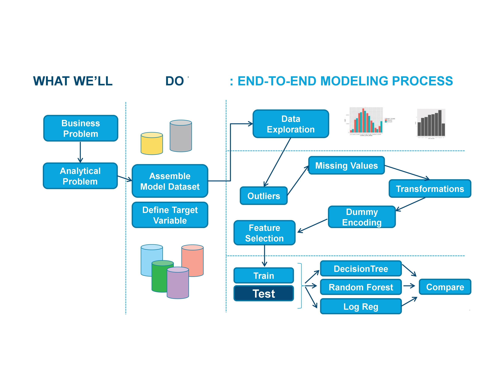

```{r message=FALSE, include=FALSE, warnings=FALSE}
library(knitr)
# make the images flow nicely
knitr::opts_chunk$set(fig.pos = 'H')
```


# Introduction

Kasi Insights uses surveys to find economic indices. One of the surveys is for Lenders.
Lenders lend to individuals. Individuals belong to a Hub within a known radius of the Hub.
Individuals are grouped as communities belonging to each hub. there are multiple communities across a country.
Currently Kasi Insights deals with seven African countries.
The questions specific to lending habbits are gathered in survey questions.
If lenders are borrowers of a bank or financial institution - we can determine the risk profile of the lenders for the Banks/Financial institutions.
Countries in Africa (South Africa, Ivory Coast, Kenya...).
These countries have custom lending process and dont have means to track the transaction history.
The data is gathered utilizing community crowd sourced survey data by Kasi Insights.


# Problem Statement

Kasi Insights needs Lending Environment Simulation Tool and Lender Evaluation Tool.
Lending Evaluation Simulation tool: TODO
Lender Evaluation Tool: TODO


# Background

Kasi Insights currently gathers the Lender Survey Results and utilizes Excel Sheet to perform calculations and get the Credit Scores for the Lenders. The need is to develop a tool which will help to evaluate the lenders and categorize them in appropriate pre-defined catogories.

 
# Dataset Description
The dataset is available for past 3 years (to be confirmed) consisting of survey results for the Lenders.
There survery results are available both in English and French.
Kasi Insights will provide the excel sheets properly sorted based on language.
The columns will be standardized across the different spread sheets so that parsing and data validation can be standardized.
The re-arranged spread sheets will be provided by Kasi Insights.
There are 10 Lender specific survey questions - which will be utilized for producing the 2 ML models.


# ML Solution

TODO
```{r example, out.width = "100%", echo=FALSE, fig.align='center', fig.cap="Approach"}
 
```# ML Solution

In et est nec ex tincidunt tincidunt in ut dui. Nam vel nulla nec nulla consectetur sagittis. Vestibulum suscipit sem vitae nisl laoreet tempor. Suspendisse quis elementum neque. Vivamus dignissim id augue ut laoreet. Nunc ac tellus tellus. Praesent bibendum eget nisi at accumsan. Quisque nec ultricies augue. Suspendisse at accumsan est. Duis ac sapien quam. Sed fermentum in leo non porta. Suspendisse volutpat massa sit amet vestibulum ornare. Duis ut cursus arcu.


# Project Plan

Suspendisse enim quam, aliquet vel risus ac, elementum egestas ex. Morbi elit dolor, malesuada posuere ullamcorper volutpat, lobortis quis dui. Cras nisl quam, finibus vel venenatis a, dapibus vel urna. In hac habitasse platea dictumst. Quisque scelerisque ante tellus, vel hendrerit orci vulputate pulvinar. Lorem ipsum dolor sit amet, consectetur adipiscing elit. Quisque posuere, quam rhoncus faucibus feugiat, erat tellus dictum nulla, vitae imperdiet dolor turpis non mauris.

## Sub Title Example

### Smaller title Example


\bibliography{RJreferences}

# Note from the Authors

This file was generated using [_The R Journal_ style article template](https://github.com/rstudio/rticles), additional information on how to prepare articles for submission is here - [Instructions for Authors](https://journal.r-project.org/share/author-guide.pdf). The article itself is an executable R Markdown file that could be [downloaded from Github](https://github.com/ivbsoftware/big-data-final-2/blob/master/docs/R_Journal/big-data-final-2/) with all the necessary artifacts.
