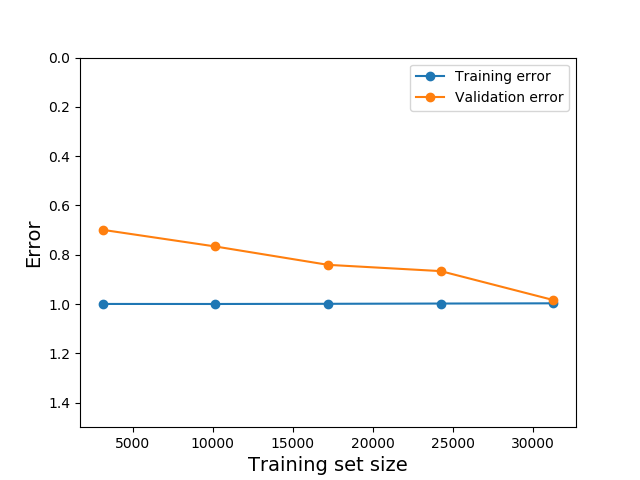

```{r message=FALSE, include=FALSE, warnings=FALSE}
library(reticulate)
library(knitr)
# make the images flow nicely
knitr::opts_chunk$set(fig.pos = 'H')
knitr::knit_engines$set(python = reticulate::eng_python)
py_config()
```
```{python echo=FALSE, message=FALSE, warnings=FALSE}
import pandas as pd
pd.set_option('display.max_columns', 50)
pd.set_option('display.width', 100)
pd.options.display.float_format = '{:,.2f}'.format
```

# Background

Let's breifly review how KASI Infight collects and uses the data.

 - Samples from the community who have lent money (lenders) are pooled and asked questions about borrowers within the community based on their personal experience.
 
 - The responses to the survey are inputted into KASI Insight credit model and a community score is computed. The score is assigned to all members of the community.
 
After intial assesment of the process and the data we understood that the existing apporach were not suatable for Machine-Learning application. We brainstormed and suggested two ways to utilize the available data. 

Firstly we put ourseves in the shoes of a lender. Being a lender we would be intrested to know how our lending pattern would affect our profit. For example if we strart lending money to the business colleges instead of family. Or we increase the interest, or we decrease the interest and increase the amount, etc. Then we though if we were a banker who were contemplating to establish a quick loan business in a specific area how would we evaluate, at least intially the credit worthiness of the pupluation. This is who we came up with the **Lending Environment Simulator** concept. This ML model could be trained on the servey answers to assign a credit category. To implement such a model we would have to have the labels for all observations; we did not have them. We discussed the problem with KASI Insight team. They came up with the credit category formula, which we describe below

## Credit Category Assignment Process

KASI team assigned weights to the survey answers that pertain to lending practice. Based on the answers of each observation we calculated the score, which was used to assign one of the five categories as follows:

 * **Very Poor** - the credit score less than **350**
 * **Poor** - the credit score is between **350 and 550**
 * **Fair** - the credit score is between **550 and 650**
 * **Good** - the credit score lies between **650 and 750**
 * **Very Good** - the credit score is higher tan **750**

and this is how we labled all observation to train the simulator classifier.

## Lender Evaluator

How else could we possibly use the data our business partner collected? We though if we were a financial insitution and wnated to have a proxy to conduct money lending business in our behalf in various communities how would we evaluate the business savvines of potential candidates? This is how we came up with the concept of **Lender Evaluator** model. I believed that the survey KASI Insight conducts not only reflet the credit wothiness of the general public but also describe the proficiency, knowledge and experience of the lender as a business partner. We only needed the formulat to evaluate the answers correctly. Again KASI Insight team was very instrumental. They created another formula to calculate the lender score based on the survey answers. We took similar to the simulator model approach, only applied different weights to the answers to calculate the lender score. Again based on each observation score we assigned the category. The categories for lenders are identical to the credit categories listed above. 


# Objectives

Through exploring and applying the latest Machine-Learning techniques we aim to deliver two ML models:
  
  - Lending Environmnet Simulator
  
  - Lender Evaluator
  
We hope that these models will be included into the product line-up of KASI Insight allowing our business partner to explore new business opportunities. We will deliver the turn-key solution that would include the user interface to demonstrate the model performance in real life. THe final product will also include a docker image to simplify the model deployment into production environment on the AWS cloud.


# Project Artifacts

All project artifacts, technical guides, this report could be found at [GitHub](https://github.com/v2msLabs/ML1030-Capstone-Project) 


# Data Analysis

As it has been already stated in this project we are using the survey data collected by KASI Insight over years from seven African countries. So far KASI insight has collected almost **30,000** records over a course of last three years.

## Data Dictionary

The survey comprises 38 columns. Majority of them are multi-choice questions. The table below lists the survey columns

ID  | Question/Column 
--- | --------------------------------------------------------- 
 0 | Timestamp 
 1 | Location ID 
 2 | Has it become more difficult or easier to find a job in your city? 
 3 | Is this a good time for people to make a large purchase such as furniture or  electrical appliances, given the economic climate? 
 4 | Compared to the last 6 months, are you able to spend (more, the same or less)  money on large purchases over the next 6 months? 
 5 | Will you be able to meet your regular expenses over the next 6 months? 
 6 | How do you expect your household’s income to change over the next 6 months? 
 7 | How do you expect general economic conditions in your city to change over the next 6 months? 
 8 | How do you expect general economic conditions in your country to change over the next 6 months? 
 9 | Gender 
 10 | Marital status 
 11 | Age 
 12 | What's your highest level of education? 
 13 | Occupation 
 14 | If you are a student, what level are you currently studying? 
 15 | Race/Ethnicity 
 16 | Country 
 17 | What is the name of the neighborhood where you live? 
 18 | Over the past 3 months, how many times have you lent someone money? 
 19 | On average how much do you lend in general? 
 20 | Who did you lend money to in the past 3 months? 
 21 | When you lend money, when do you usually expect to get it repaid? 
 22 | Do you include either interest or a lending fee when you lend? 
 23 | Do you request guarantees when you lend? 
 24 | Do you receive your money back in time? 
 25 | Assuming that you have lent money at least ten times, how often would you get  your money repaid? 
 26 | What's the most common use of the money you lend? 
 27 | Have you ever applied for a bank loan? 
 28 | Are you a tontine / lending club member? 
 29 | What is the most convenient way to get a loan? 
 30 | To what extent do you agree with the following sentences [Access to credit is  essential for me to achieve financial freedom] 
 31 | To what extent do you agree with the following sentences [Credit is beneficial only if you have discipline] 
 32 | To what extent do you agree with the following sentences [I would like to have more credit management training] 
 33 | What type of loans are you currently paying of? 
 34 | Do you have a credit score? 
 35 | Do you have a credit card? 
 36 | On average, how much of your total household monthly income do you spend paying off debt each month? 
 37 | If you wanted to take a loan to start a business, how much would you need? 


The survey data could be split into three major categories:

- Demographic Statistics.
- Economic Sentiment.
- Spending and Borrowing habits.

Each question/column should be treated as a categorical value.

## Data Exploration

Let's take a look at the raw survey data. Though the survey multi-choice questions are categories in nature, the survey answers are stored in alphanumeric format. Overtime some questions have been rephrased. Thus in some cases the answers that pertain to the same category vary. Another problem with the raw data set is the missing values.

```{python echo=FALSE}
import glob
input_path_original = "../../data/original/**"
paths = glob.glob(input_path_original)
dfo = pd.concat([pd.read_csv(f,names=range(0,38),header=0,low_memory=False) for f in paths],ignore_index = True)
print(dfo[[2,3,4,5]].head())
print(dfo[[6,7,8,9]].head())
print(dfo[[10,11,12,13]].head())
```

To rectify the problems stated above we have developed a data processing algorithm that normalized and categorized the answers converting them into numeric form. The data processing script also imputes the missing data with the most frequently occurring value for a given category. The clean data set stats are depicted below. **Note**: the column numbers correspond to the question numbers as described in *Data Dictionary* paragraph.

```{python echo=FALSE}
input_path = "../../data/processed/clean_data.csv"
df = pd.read_csv(input_path)
print(df.describe())
```

Evidently now all the data is categorized, the missing values imputed. From this point on we will be using the clean data set to do further data exploration, feature engineering and model training. 

### Demographic Stats

It is useful to understand who took the survey. This knowledge will ultimately give us the answers about the money market participants in Africa.

```{r pc, out.width = "115%", echo=FALSE, fig.align='center', fig.cap="Participation per Country"}
include_graphics("../../artifacts/obs_per_country.png") 
```
```{r pa, out.width = "115%", echo=FALSE, fig.align='center', fig.cap="Age of Participans"}
include_graphics("../../artifacts/participant_age.png")
```
```{r pe, out.width = "115%", echo=FALSE, fig.align='center', fig.cap="Education of Participants"}
include_graphics("../../artifacts/participant_education.png")
```
```{r pms, out.width = "115%", echo=FALSE, fig.align='center', fig.cap="Marital Status of Participants"}

```
As per the charts submitted above we can conclude that:

- Cameroon has the highest number of observations and Tanzania has the smallest representation, where the rest of the countries or more or less equally represented.
- Males dominate in the money lending business. Kenya though makes an exception where number of female participants is very close to the male population
- In general people in *30-34* age group are the most active, followed by *25-29* and *18-24* age groups respectively. In Kenya, unlike other countries, the younger generation is more active.
- Majority of money lenders are either salaried or commission-based employees. Again Kenya makes an exception. The second largest group of the money lenders is the business owners.
- Education-wise people with the bachelor's degree and skilled trade workers dominate. 
- Married people tend to lend money more often...

### Economic Sentiment

Now let's see what the money lenders think about the state of the economy in their respective countries. The questions where asked in the six-month perspective in the future from the date of survey.

```{r esent, out.width = "115%", echo=FALSE, fig.align='center', fig.cap="Economic Sentiment"}
include_graphics("../../artifacts/sentiment.png") 
```

Evidently majority of the survey participants think that the economic situation in their country will be stable over a course of next six months. Many people in Kenya, Nigeria and Ghana find it more difficult to find a job. Remarkably, despite the fact that people believe that the economic conditions are stable,  citizens of all counties are not sure if they are going to meet their regular expenses.


### Spending and Borrowing Habits

Spending and borrowing habits is the segment of our particular interest since it affects the most the credit score of the population.

```{r bh, out.width = "115%", echo=FALSE, fig.align='center', fig.cap="Borrowing Habits"}
include_graphics("../../artifacts/borrowing.png") 
```
```{r sh, out.width = "115%", echo=FALSE, fig.align='center', fig.cap="Spending Habits"}

```
```{r dtp, out.width = "115%", echo=FALSE, fig.align='center', fig.cap="Debt Payment"}
include_graphics("../../artifacts/payment.png")
```

- Majority of population take either small or micro loans (the exact amounts are country specific).
- It is quite remarkable that the lenders do not charge fees or interest regularly (if at all) more often than not. The Cameroonians make an exception. In opposite the majority of South African lenders never change interest. We have conducted further data research that have proved that many people tend to lend to friends and family. This fact explains why the fees and interest on loans are waived.
- People in Cameroon, Cote d'Ivoire and Tanzania spend the loans to cover business-related expenses. Citizens of other countries mainly use loan to either cover one-time or or unexpected expenses (wedding, medical emergency..) or make ends meet (pay rent, buy clothes, etc.) 
- Interestingly people in all countries do not watch how they spend the borrowed money. This fact probably explains why the question *Will you be able to meet your regular expenses?* generates uncertain answers (see **Economic Sentiment** paragraph for further details).


## Data Distribution between Categories

There are five credit categories for borrowers and five lender categories. To train the robust classification models we have to ensure that each category has enough observations to support the model training. Let's review the data distribution between the borrower and lender categories. 

```{r dc, out.width = "115%", echo=FALSE, fig.align='center', fig.cap="Data Distribution per Credit Categories"}
include_graphics("../../artifacts/bcategories.png") 
```

```{r dl, out.width = "115%", echo=FALSE, fig.align='center', fig.cap="Data Distribution per Lender Categories"}
include_graphics("../../artifacts/lcategories.png")
```

As we can observe overall the lending environment is not very promising; categories 1 and 2 (*Very Poor* and *Poor*) dominate. The lending climate is visibly better in Cameroon, Cote d'Ivoire and South Africa. It is also worth mentioning that categories 4 and 5 (*Good* and *Very Good*) do not have that much data. The situation is even worse with the lender categories. Thus prior to the model training we would have to upsample the training data sets to bring all categories to the same level.

Overall looking at the credit and lender scores of the population we observe that the distribution pattern is very similar between all seven African countries. Thus if KASI Insight adds more countries to the fold there is no need to retrain the models assuming that the newly added countries have the same category distribution...

# Feature Selection and Engineering

The data set has 38 columns. We potentially, could employ all of them to fit the models. But this is not the optimal approach. Not all data elements contribute to the category identification equally, some may not contribute at all, so why keep them? Another consideration is that the large and wide data sets make model training much longer, affect the accuracy and speed of the models negatively. Also many input variables add complexity to the user interface making it hard to implement, maintain and use. Thus we have opted to evaluated available data features. The ultimate goal is to understand the relationship between the features and the response variables and select the most influential ones.

## Feature Correlation Matrix

Strongly correlated features are redundant thus they could be dropped without impacting the model performance. Figure \ref{fig:cmatrix} depicts a correlation heatmap of all 38 data set features. The correlated features would be rendered either in deep black or very light colors. As we can observe none of the features have strong correlation.

```{r cmatrix, out.width = "75%", echo=FALSE, fig.align='center', fig.cap="Feature Correlation"}

```

## Univariate Feature Selection

Univariate feature selection examines each feature individually to determine the strength of the relationship of the feature with the response variable. Next two paragraphs examine relationship between top 20 features and credit and lender categories respectively.

### Credit Score Univariate Feature Selection

Num | Feature                                                          | Score
----|------------------------------------------------------------------|--------
24 | Do you receive your money back in time? | 4749.1
18 | Over the past 3 months, how many times have you lent someone money? | 1077.69
26 | What's the most common use of the money you lend? | 727.16
22 | Do you include either interest or a lending fee when you lend? | 536.27
19 | On average how much do you lend in general? | 512.08
20 | Who did you lend money to in the past 3 months? | 441.73
33 | What type of loans are you currently paying of? | 360.28
23 | Do you request guarantees when you lend? | 351.02
14 | If you are a student, what level are you currently studying? | 301.56
21 | When you lend money, when do you usually expect to get it repaid? | 218.30
16 | Country | 197.034
25 | Assuming that you have lent money at least ten times, how often would you get your money repaid? | 180.84
11 | Age | 103.30
12 | What's your highest level of education? | 75.24
29 | What is the most convenient way to get a loan? | 63.37
2 | Has it become more difficult or easier to find a job in your city? | 55.15
10 | Marital status | 39.54
31 | To what extent do you agree with the following sentences [Credit is beneficial only if you h... | 35.68
30 | To what extent do you agree with the following sentences [Access to credit is essential for ... | 31.48
32 | To what extent do you agree with the following sentences [I would like to have more credit m... | 25.52


### Lender Score Univariate Feature Selection

Num | Feature                                                          | Score
----|------------------------------------------------------------------|--------
24 | Do you receive your money back in time? | 6667.83
22 | Do you include either interest or a lending fee when you lend? | 3588.47
23 | Do you request guarantees when you lend? | 3339.37
18 | Over the past 3 months, how many times have you lent someone money? | 2014.33
16 | Country | 595.87
25 | Assuming that you have lent money at least ten times, how often would you get your money repaid? | 555.59
19 | On average how much do you lend in general? | 460.15
26 | What's the most common use of the money you lend? | 444.85
20 | Who did you lend money to in the past 3 months? | 415.17
14 | If you are a student, what level are you currently studying? | 174.17
21 | When you lend money, when do you usually expect to get it repaid? | 112.94
37 | If you wanted to take a loan to start a business, how much would you need? | 91.9
28 | Are you a tontine / lending club member? | 78.77
27 | Have you ever applied for a bank loan? | 76.69
4 | Compared to the last 6 months, are you able to spend (more, the same or less) money on large pur... | 56.49
11 | Age | 44.33
8 | How do you expect general economic conditions in your country to change over the next 6 months? | 42.94
32 | To what extent do you agree with the following sentences [I would like to have more credit manag... |  39.22
2 | Has it become more difficult or easier to find a job in your city? | 38.57
35 | Do you have a credit card? | 37.26


## Feature Importance

We measure the importance of a feature by calculating the increase in the model’s prediction error after permuting the feature. A feature is “important” if shuffling its values increases the model error, because in this case the model relied on the feature for the prediction. A feature is “unimportant” if shuffling its values leaves the model error unchanged, because in this case the model ignored the feature for the prediction.

### Credit Score Feature Importance Evaluation

```{r cfi, out.width = "100%", echo=FALSE, fig.align='center', fig.cap="Credit Score Feature Impoirtance"}

```

### Lender Score Feature Importance Evaluation

```{r lfi, out.width = "100%", echo=FALSE, fig.align='center', fig.cap="Lender Score Feature Impoirtance"}

```

## Takeaways

We have applied two mathematical algorithms to identify the most significant features for credit score and lender score labels. To no surprise both methods have successfully identified the feature that have been used to calculate the credit/ lender categories. We have decided to select the top features that have distinctively higher score as a base-line. During the model training and evaluation phase  we will increase/decrease the number of features to estimate the effect of the input data dimentionality change the model accuracy.

### Top Seven Credit Score Features 

Num | Feature                                                         
----|------------------------------------------------------------------
24 | Do you receive your money back in time? 
26 | What's the most common use of the money you lend?
22 | Do you include either interest or a lending fee when you lend?
18 | Over the past 3 months, how many times have you lent someone money?
20 | Who did you lend money to in the past 3 months? 
23 | Do you request guarantees when you lend? 
19 | On average how much do you lend in general?


### Top Nine Lender Score Features

Num | Feature                                                         
----|------------------------------------------------------------------
24 | Do you receive your money back in time? 
18 | Over the past 3 months, how many times have you lent someone money?
22 | Do you include either interest or a lending fee when you lend?
23 | Do you request guarantees when you lend?
20 | Who did you lend money to in the past 3 months? 
26 | What's the most common use of the money you lend?
19 | On average how much do you lend in general?
25 | Assuming that you have lent money at least ten times, how often would you get your money repaid?
16 | Country


## Model Evaluation and Selection

After we cleaned and normalized the data, labeled all observations and gained deep understanding about the features we are ready to start model training and evaluation. To gain the best result possible we will explore and evaluate three algorithm to train the models. They are:

 * **Support Vector Machine** (SVM). The greatest strength of SVM is that it has multiple Kernel implementations, that can be tuned to explain multi-dimensional space with high accuracy
  * **Random Forest** (RF). Random forest belongs to the class of ensemble models. It has many hyper-parameters that could be tuned to achieve high accuracy. The random forest algorithm is not demanding in terms of the data preparation, which makes it the first choice in many real-life scenarios
  * **Gradient Boosting Machine** (GBM). GBM is an ensemble model as well. It uses the concept of trees just like the RF model does but applies it differently. GBT builds the trees one at a time, where each new tree helps to correct errors made by previously trained tree. the GBM.

### Evaluation Metrics

We believe that the best model has to classify all five categories as accurate as possible. The winning model also would have to identify true positives and true negatives for each category equally well. Thus we choose the multiclass confusion matrix and F1 scores to evaluate the models. The higher the F1 score for each category - the better the model performs.

We also take into consideration the model training and inference speed.


### Model Training and Evaluation Methodology

- For the base-line models training we will use top seven feature for the simulator and top nine feature for the evaluator respectively.
- We begin with the splitting the available data into the training (70%) and test (30%) sets.
- We upsample the training data set employing *SMOTE* algorithm.
- We evaluate the three algorithms we have described above. We will be using the default algorithm parameters and top features (see *Feature Evaluation* paragraph for more details) to fit the models. 
- We select the algorithm that has the best evaluation metrics.
- Then we evaluate the winning algorithm fitting it with the smaller and larger feature sets.
- If the data dimentionality change makes positive impact on the the winning algorithm we select this feature set for the model.
- Finally we hyper-tune the algorithm parameters in effort to achieve even better model performance


### Lending Environment Simulator Model


Following the steps outlined in the previous section we have received the following performances stats:


#### SVM

                  precision    recall  f1-score   support
           1       0.97      0.95      0.96      3935
           2       0.92      0.90      0.91      3114
           3       0.81      0.89      0.85      1122
           4       0.81      0.85      0.83       487
           5       0.81      0.89      0.85       157
           
    micro avg      0.92      0.92      0.92      8815
    macro avg      0.86      0.90      0.88      8815
    weighted avg   0.92      0.92      0.92      8815
    
    Overall algorithm accuracy: 0.9199
    
#### Random Forest

                  precision    recall  f1-score   support
           1       0.98      0.96      0.97      3902
           2       0.93      0.93      0.93      3161
           3       0.86      0.90      0.88      1150
           4       0.86      0.84      0.85       464
           5       0.86      0.87      0.87       138
           
     micro avg     0.94      0.94      0.94      8815
     macro avg     0.90      0.90      0.90      8815
     weighted avg  0.94      0.94      0.94      8815
     
     Overall algorithm accuracy: 0.9372

#### Gradient Boosting

              precision    recall  f1-score   support
           1       0.98      0.92      0.95      3948
           2       0.85      0.87      0.86      3117
           3       0.70      0.67      0.69      1149
           4       0.60      0.82      0.70       471
           5       0.60      0.88      0.71       130
           
     micro avg     0.86      0.86      0.86      8815
     macro avg     0.75      0.83      0.78      8815
     weighted avg  0.87      0.86      0.87      8815
     
     Overall algorithm accuracy: 0.8635


### The Best Lending Environment Simulator Model

The **Random Forest** algorithm has come up on top. This model classifies all categories much better then the other two algorithms and demonstrates a nice balance between the recall and precision metrics. The Random forest algorithm is also the fastest to train.

 Category | **RF f1-score** | SVM f1-score | GB f1-score 
----------|-------------|--------------|-------------
 1        |  **0.97**       |  0.96        |  0.95
 2        |  **0.93**       |  0.91        |  0.86
 3        |  **0.88**       |  0.85        |  0.69
 4        |  **0.85**       |  0.83        |  0.70
 5        |  **0.87**       |  0.85        |  0.71
 Accuracy |  **0.9372**     |  0.9199      |  0.8635        


### Dimentionality Change

The winning algorithm performs quite spectacular. It employs the **seven** top features we have identified in the *Feature Selection* section. Let's see how the input data dimentionality change affects the model performance. Firstly we reduce the number of features to **five**.

Top five features

Num | Feature                                                         
----|------------------------------------------------------------------
24 | Do you receive your money back in time? 
26 | What's the most common use of the money you lend?
22 | Do you include either interest or a lending fee when you lend?
18 | Over the past 3 months, how many times have you lent someone money?
20 | Who did you lend money to in the past 3 months?

Model Performance:

             precision    recall  f1-score   support
           1       0.94      0.91      0.92      3858
           2       0.84      0.74      0.79      3150
           3       0.58      0.73      0.65      1210
           4       0.55      0.71      0.62       464
           5       0.55      0.89      0.68       133

    micro avg      0.81      0.81      0.81      8815
    macro avg      0.69      0.80      0.73      8815
    weighted avg   0.83      0.81      0.82      8815

    Overall algorithm accuracy: 0.8635
    
Evidently the dimentionality reduction caused the model performance deteriorate greatly. Now let's increase the number of features to **nine**.

Top nine features:

Num | Feature                                                         
----|------------------------------------------------------------------
24 | Do you receive your money back in time? 
26 | What's the most common use of the money you lend?
22 | Do you include either interest or a lending fee when you lend?
18 | Over the past 3 months, how many times have you lent someone money?
20 | Who did you lend money to in the past 3 months? 
23 | Do you request guarantees when you lend? 
19 | On average how much do you lend in general?
16 | Country
21 | When you lend money, when do you usually expect to get it repaid?

Model Performance:

              precision    recall  f1-score   support

           1       0.99      0.98      0.98      3893
           2       0.96      0.96      0.96      3159
           3       0.89      0.92      0.91      1151
           4       0.85      0.87      0.86       482
           5       0.88      0.88      0.88       130

     micro avg     0.95      0.95      0.95      8815
     macro avg     0.91      0.92      0.92      8815
     weighted avg  0.96      0.95      0.95      8815
     
     Overall algorithm accuracy: 0.9547

The dimentionality increase gave us a performance boost of almost **2%**. It might not seem much. Let see how performance of each category has been affected.

 Category | 5 Features | 7 Features (base line) | **9 Features** |  Gain (%)
----------|------------|------------------------|----------------|-----------    
 1        |  0.92      |  0.96                  | **0.98**       | 2
 2        |  0.79      |  0.93                  | **0.96**       | 3
 3        |  0.65      |  0.88                  | **0.91**       | 3 
 4        |  0.62      |  0.85                  | **0.86**       | 1
 5        |  0.68      |  0.87                  | **0.88**       | 1

Evidently categories 2 (*Poor*) and 3 (*Fair*) have benefited the most form the dimentionality increase. Ultimately it is up to the business to decide if 3%  accuracy gain is worth the training time and user interface complexity increase. KASI Insight representative has opted for higher accuracy.

### Hyper-parameter Tuning

Hyper-parameter tuning is usually the last step in effort to improve the model performance. We will employ *Grid Search* algorithm with **three-fold cross validation** to identify the best model parameters. The parameter grid look as follows:

 Parameter            |    Values 
----------------------|--------------------
Number of Estimators  | 200, 300, 400
Minimum Sample Split  | 5, 10, 20, 30, 40
Maximum Features      | 'auto', 'sqrt'
Bootstrap:            | True, False

The hyper-parameter tuning gave us another **0.5%** performance gain.

### Final Simulator Model Stats

- Number of features: **9**
- Overall algorithm accuracy: **0.9594**

```{r simulator_cm, out.width = "100%", echo=FALSE, fig.align='center', fig.cap="Simulator Model Confusion Matrix"}

```

              precision    recall  f1-score   support

           1       0.99      0.99      0.99      3940
           2       0.96      0.96      0.96      3098
           3       0.91      0.90      0.90      1154
           4       0.83      0.88      0.86       471
           5       0.89      0.87      0.88       152

     micro avg     0.96      0.96      0.96      8815
     macro avg     0.92      0.92      0.92      8815
     weighted avg  0.96      0.96      0.96      8815

Lastly we are going to review the model learning and validation curves. As per figure \ref{fig:simulator_lc} the model was learning more about the data as the training size grew. When the training size reached about 30,000 observations the validation curve converged with the training one indicating that the further increase in the training set size will not likely result in better model performance.

```{r simulator_lc, out.width = "100%", echo=FALSE, fig.align='center', fig.cap="Simulator Model Learning Curves"}

```


## Lender Evaluator

Without further due let's apply the same methodology to select *Lender Evaluator* classifier.

#### SVM


              precision    recall  f1-score   support

           1       0.98      0.96      0.97      4053
           2       0.93      0.94      0.94      3249
           3       0.88      0.93      0.90      1272
           4       0.81      0.83      0.82       209
           5       0.75      0.66      0.70        32

    micro avg      0.94      0.94      0.94      8815
    macro avg      0.87      0.86      0.87      8815
    weighted avg   0.94      0.94      0.94      8815

    Overall algorithm accuracy: 0.9441


#### Random Forest

              precision    recall  f1-score   support

           1       0.99      0.98      0.99      4038
           2       0.97      0.98      0.97      3289
           3       0.95      0.95      0.95      1261
           4       0.89      0.82      0.85       197
           5       0.89      0.53      0.67        30

    micro avg      0.97      0.97      0.97      8815
    macro avg      0.94      0.85      0.89      8815
    weighted avg   0.97      0.97      0.97      8815

    Overall algorithm accuracy: 0.972
    

#### Gradient Boosting


              precision    recall  f1-score   support

           1       0.99      0.95      0.97      4066
           2       0.92      0.92      0.92      3261
           3       0.81      0.87      0.84      1218
           4       0.67      0.86      0.75       235
           5       0.68      0.80      0.74        35

    micro avg      0.93      0.93      0.93      8815
    macro avg      0.81      0.88      0.84      8815
    weighted avg   0.93      0.93      0.93      8815

    Overall algorithm accuracy: 0.925
    
### The Best Lender Evaluator Model

Again the **Random Forest** algorithm proved to be the most accurate. Though it does not identify category 5 observations as well as the other two algorithm we hope that the input data dimentionality increase and hyper-parameter tuning will rectify the problem.


 Category | **RF f1-score** | SVM f1-score | GB f1-score 
----------|-------------|--------------|-------------
 1        |  **0.99**       |  0.97        |  0.97
 2        |  **0.97**       |  0.94        |  0.92
 3        |  **0.95**       |  0.90        |  0.84
 4        |  **0.85**       |  0.82        |  0.75
 5        |  **0.67**       |  0.70        |  0.74
 Accuracy |  **0.972**     |  0.9441      |  0.925    
 
 
### Dimentionality Change

Let's evaluate how the number of features affect the accuracy of the model. Just like in the case of the simulator model we begin with the smaller feature set, namely seven.

Top seven features:

Num | Feature                                                         
----|------------------------------------------------------------------
24 | Do you receive your money back in time? 
26 | What's the most common use of the money you lend?
22 | Do you include either interest or a lending fee when you lend?
18 | Over the past 3 months, how many times have you lent someone money?
20 | Who did you lend money to in the past 3 months? 
23 | Do you request guarantees when you lend? 
19 | On average how much do you lend in general?


Model Performance:

          precision    recall  f1-score   support

           1       0.99      0.97      0.98      4005
           2       0.96      0.95      0.95      3330
           3       0.89      0.95      0.92      1252
           4       0.84      0.92      0.88       205
           5       0.84      0.70      0.76        23

    micro avg      0.96      0.96      0.96      8815
    macro avg      0.90      0.90      0.90      8815
    weighted avg   0.96      0.96      0.96      8815 

    Overall algorithm accuracy: 0.9585    
    
Surprisingly the dimentionality reduction resulted in better model performance!  


Top ten features:

Num | Feature                                                         
----|------------------------------------------------------------------
24 | Do you receive your money back in time? 
18 | Over the past 3 months, how many times have you lent someone money?
22 | Do you include either interest or a lending fee when you lend?
23 | Do you request guarantees when you lend?
20 | Who did you lend money to in the past 3 months? 
26 | What's the most common use of the money you lend?
19 | On average how much do you lend in general?
25 | Assuming that you have lent money at least ten times, how often would you get your money repaid?
16 | Country
21 | When you lend money, when do you usually expect to get it repaid?


Model Performance:

              precision    recall  f1-score   support

           1       0.99      0.99      0.99      4058
           2       0.97      0.98      0.97      3216
           3       0.94      0.96      0.95      1273
           4       0.92      0.85      0.88       229
           5       0.97      0.74      0.84        39

    micro avg      0.98      0.98      0.98      8815
    macro avg      0.96      0.90      0.93      8815
    weighted avg   0.98      0.98      0.98      8815

    Overall algorithm accuracy: 0.975
    
    

The dimentionality increase yields the best performance. The category 5 identification has been improved the most. The top ten feature set is an ultimate winner.


 Category | 7 Features** | 9 Features (base-line) | **10 Features** |  Gain (%)
----------|----------------|------------------------|-------------|-----------    
 1        |  0.98      |  0.99                  | **0.99**        | 0
 2        |  0.95      |  0.97                  | **0.97**        | 0
 3        |  0.92      |  0.95                  | **0.95**        | 0 
 4        |  0.88      |  0.85                  | **0.88**        | 3
 5        |  0.76      |  0.67                  | **0.84**        | 17
 

### Hyper-parameter Tuning 

The selected model demonstrates quite spectacular accuracy. We could potentially improve the identification of the category # 5. We are going to apply Grid Search algorithm again trying to find the optimal hyper-parameters.

Parameter grid:

 Parameter            |    Values 
----------------------|--------------------
Number of Estimators  | 200, 300, 400
Minimum Sample Split  | 5, 10, 20, 30, 40
Maximum Features      | 'auto', 'sqrt'
Bootstrap:            | True, False

The hyper-parameter tuning has demonstrated similar to the default parameter performance.


### Final Evaluator Model Stats

- Number of features: **10**
- Overall algorithm accuracy: **0.9756**

```{r evaluator_cm, out.width = "100%", echo=FALSE, fig.align='center', fig.cap="Evaluator Model Confusion Matrix"}

```

           precision    recall  f1-score   support

           1       0.99      0.99      0.99      4110
           2       0.98      0.98      0.98      3237
           3       0.94      0.96      0.95      1217
           4       0.90      0.82      0.86       214
           5       0.96      0.73      0.83        37

    micro avg      0.98      0.98      0.98      8815
    macro avg      0.95      0.90      0.92      8815
    weighted avg   0.98      0.98      0.98      8815

Lastly we are going to review the model learning and validation curves. As per figure \ref{fig:evaluator_lc} the model was learning more about the data as the training size grew. When the training size reached about 30,000 observations the validation curve converged with the training one indicating that the further increase in the training set size will not likely result in better model performance.

```{r evaluator_lc, out.width = "100%", echo=FALSE, fig.align='center', fig.cap="Eval Model Learning Curves"}

```


# Model Deployment

## Architecture

## Docker


# Conclusion

We started this project with leraning the business of KASI Insight - our partner. We explored the company data, understood the challenges and objectives. After gaining good feel about the company and its business we suggested a few concepts that we beleieved would allow our business partner to extend its business offering. The concept employed Machine-Learning techniques. Working closely with KASI Insight team we developed a methodology that allowed us to apply KASI Insight data to train the ML models. As a result of this close collaboration we came up with a project proposal that met the objectves of our business partner and allowed us hone our ML skills.  We promised to:

 - Develop Lending Environment Simulator model
 - Train Lender Evaluator model
 - Deliver key-turn solution that would include:
    - an on-line service that provides access the models
    - a Web-based client that would demonstrate the models in action
    - a docker image that would include all software tiers and be used for easy deployment of the system in cloud environment
    
We can proudly conclude that we have achieved all these goals.     


\bibliography{RJreferences}

# Note from the Authors

This file was generated using [_The R Journal_ style article template](https://github.com/rstudio/rticles), additional information on how to prepare articles for submission is here - [Instructions for Authors](https://journal.r-project.org/share/author-guide.pdf). The article itself is an executable R Markdown file that could be [downloaded from Github](https://github.com/ivbsoftware/big-data-final-2/blob/master/docs/R_Journal/big-data-final-2/) with all the necessary artifacts.
