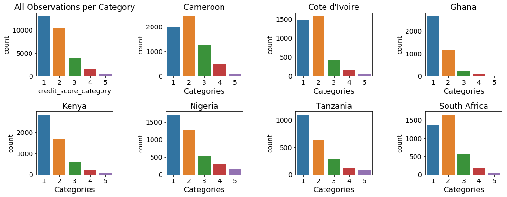

```{r message=FALSE, include=FALSE, warnings=FALSE}
library(reticulate)
library(knitr)
# make the images flow nicely
knitr::opts_chunk$set(fig.pos = 'H')
knitr::knit_engines$set(python = reticulate::eng_python)
py_config()
```
```{python echo=FALSE, message=FALSE, warnings=FALSE}
import pandas as pd
from tabulate import tabulate
pd.set_option('display.max_columns', 50)
pd.set_option('display.width', 100)
pd.options.display.float_format = '{:,.2f}'.format
```

# Background


# Objectives


# GitHub


# Data Analysis

As it has been mentioned KASI Insight does not posess personal financial data that could be used to identify and predict client credit worthiness. In this project we are using the survey data collected by KASI Insight over years from seven African countries. The survey targets people who lend money on regular basis. The survey contains questions pertaining to the borrowing habits of the people the lenders deal with, asks respondents  what they feel about the economy in a given country, etc. KASI insight has collected almost **30,000** records over a course of last three years.


## Data Dictionary

The survey comprises 38 columns. Majority of them are multi-choice questions. The table below lists the survey columns

ID  | Question/Column 
--- | --------------------------------------------------------- 
 0 | Timestamp 
 1 | Location ID 
 2 | Has it become more difficult or easier to find a job in your city? 
 3 | Is this a good time for people to make a large purchase such as furniture or  electrical appliances, given the economic climate? 
 4 | Compared to the last 6 months, are you able to spend (more, the same or less)  money on large purchases over the next 6 months? 
 5 | Will you be able to meet your regular expenses over the next 6 months? 
 6 | How do you expect your household’s income to change over the next 6 months? 
 7 | How do you expect general economic conditions in your city to change over the next 6 months? 
 8 | How do you expect general economic conditions in your country to change over the next 6 months? 
 9 | Gender 
 10 | Marital status 
 11 | Age 
 12 | What's your highest level of education? 
 13 | Occupation 
 14 | If you are a student, what level are you currently studying? 
 15 | Race/Ethnicity 
 16 | Country 
 17 | What is the name of the neighborhood where you live? 
 18 | Over the past 3 months, how many times have you lent someone money? 
 19 | On average how much do you lend in general? 
 20 | Who did you lend money to in the past 3 months? 
 21 | When you lend money, when do you usually expect to get it repaid? 
 22 | Do you include either interest or a lending fee when you lend? 
 23 | Do you request guarantees when you lend? 
 24 | Do you receive your money back in time? 
 25 | Assuming that you have lent money at least ten times, how often would you get  your money repaid? 
 26 | What's the most common use of the money you lend? 
 27 | Have you ever applied for a bank loan? 
 28 | Are you a tontine / lending club member? 
 29 | What is the most convenient way to get a loan? 
 30 | To what extent do you agree with the following sentences [Access to credit is  essential for me to achieve financial freedom] 
 31 | To what extent do you agree with the following sentences [Credit is beneficial only if you have discipline] 
 32 | To what extent do you agree with the following sentences [I would like to have more credit management training] 
 33 | What type of loans are you currently paying of? 
 34 | Do you have a credit score? 
 35 | Do you have a credit card? 
 36 | On average, how much of your total household monthly income do you spend paying off debt each month? 
 37 | If you wanted to take a loan to start a business, how much would you need? 


The survey data could be split into three major categories:

- Demographice Statistics
- Economic Sentiment
- Spending and Borrowing habits

Each question/column should be trated as a catigorical value.

## Data Exploration

Let's take a look at the raw survey data. Though the survey multi-choice questions are catergories in nature, the survey answers are stored in alphanumeric format. Overtime some questions have been rephrased. Thus in some cases the answers that pertain to the same category vary. Another problem with the raw data set is the missing values.

**TO DO: insert the sample of raw data here**

To ractify the problems stated above we have developed a data processing algorithm that normalized and categorised the answers converting them into numeric form. The data processing script also imputes the missing data with the most frequently occuring value for a given category. The clean data set stats are depicted below. **Note**: the column numbers corespond to the question numbers as described in *Data Dictionary* paragraph.

```{python echo=FALSE}
input_path = "../../data/processed/clean_data.csv"
df = pd.read_csv(input_path)
print(df.describe())
```

Evidently now all the data is categorized, the missing values imputed. From this point on we will be using the clean data set to do further data exploration, feature engineering and model training. 

### Demographic Stats

It is useful to understand who took the survey. This knowledge will ultimately gives us the answers about the money market participants in Africa.

```{r pc, out.width = "115%", echo=FALSE, fig.align='center', fig.cap="Participation per Country"}
 
```
```{r pa, out.width = "115%", echo=FALSE, fig.align='center', fig.cap="Age of Participans"}

```
```{r pe, out.width = "115%", echo=FALSE, fig.align='center', fig.cap="Education of Participants"}
include_graphics("../../artifacts/participant_education.png")
```
```{r pms, out.width = "115%", echo=FALSE, fig.align='center', fig.cap="Marital Status of Participants"}
include_graphics("../../artifacts/participant_marital.png")
```
As per the charts submitted above we can canlude that:

- Camerun has the highest number of obervations and Tansania ihas the smallets representation, where the rest of the countries or more or less equaly represented.
- Males dominate in the money lending business. Kenya though makes an exception where number of femail participants is very close to the male population
- In general people in *30-34* age group are the most active, followed by *25-29* and *18-24* age groups respectively. In Kenya, unlike other countries, the yonger generation is more active.
- Majority of money lenders are either salaried or comission-based employees. Again Kenya makes an exption. The second largest group of the money lenders is the busines owners.
- Education-wise people with the bachelor's degree and skilled trade workers dominate. 
- Married people tend to lend money more often...

### Economic Sentiment

Now let's see what the money lenders think about the state of the economy in ther respective countries. The questions where asked in the six-month perspective in the future from the date of survey.

```{r esent, out.width = "115%", echo=FALSE, fig.align='center', fig.cap="Economic Sentiment"}
 
```

Evidently majority of the survey participants think that the economic situation in their country will be stable over a course of next six months. Many people in Kenya, Nigeria and Ghana find it more diffiult to find a job. Remarkably, despite the fact that people believe that the economic conditions are stable,  citisens of all counties are not shure if they are going to meet their reqular expences.


### Spending and Borrowing Habits

Spending and borrowing habits is the segment of our particular interest since it affects the most the credit score of the population.

```{r bh, out.width = "115%", echo=FALSE, fig.align='center', fig.cap="Borrowing Habits"}
 
```
```{r sh, out.width = "115%", echo=FALSE, fig.align='center', fig.cap="Spending Habits"}
include_graphics("../../artifacts/spending.png")
```
```{r dtp, out.width = "115%", echo=FALSE, fig.align='center', fig.cap="Debt Payment"}

```

- Majority of population take either small or micro loans (the exact amounts are country specific).
- It is quite remarkable that the lenders do not charge fees or interest regularly (if at all) more often than not. The Cameroonians make an exception. In opposite the majority of South African lenders never change interest. We have conducted furhter data research that have proved that many people tend to lend to friends and familty. This fact explains why the fees and interest on loans are waived.
- People in Cameroon, Cote d'Ivoire and Tanzania spend the loans to cover business-related expenses. Citizens of other countries mainly use loan to either cover one-time or or unexpected expences (wedding, medical emergency..) or make ends meet (pay rent, buy clothes, etc.) 
- Interestingly people in all countries do not watch how they spend the borrowed money. This fact probably explains why the question *Will you be able to meet your reqular expenses?* genrates uncertain answers (see **Economic Sentiment** paragraph for futher details).


## Data Distribution between Categories

There are five credit categories for borrowers and five lender categories. To train the robust classification models we have to ensure that each category has enough observations to support the model traing. Let's review the data distribution between the borrower and lender categories. 

```{r dc, out.width = "115%", echo=FALSE, fig.align='center', fig.cap="Data Distribution per Credit Categories"}
 
```

```{r dl, out.width = "115%", echo=FALSE, fig.align='center', fig.cap="Data Distribution per Lender Categories"}

```

As we can observe overall the lending environmnet is not very promising; categories 1 and 2 (*Very Poor* and *Poor*) dominate. The lending climate is visibly better in Cameroon, Cote d'Ivoire and South Africa. It is also worth mentioning that categories 4 and 5 (*Good* and *Very Good*) do not have that much data. The situation is even worse with the lender categories. Thus prior to model training we would have to upsmple the training data sets to bring all categories to the same level.   

# Feature Selection and Engineering

The data set has 38 columns. We potentially, could employ all of them to fit the models. But this is not the optimal approach. Not all data elements contribute to the category identification equally, some may not contribute at all, so why keep them? Another consideration is that the large and wide data sets make model training much longer, affect the accuracy and speed of the models negatively. Also many input variables add complexity to the user interface making it hard to implement, maintain and use. Thus we have opted to evaluated available data features. The ultimate goal is to undersatand the relationship between the features and the response variables and select the most infulential ones.

## Feature Correlation Matrix

Strongly correlated features are redundant thus they could be dropped without impacting the model performance. Figure \ref{fig:cmatrix} depicts a correlation heatmap of all 38 data set features. The correlated features would be rendered either in deep black or very light colors. As we can observe none of the features have strong correlation.

```{r cmatrix, out.width = "100%", echo=FALSE, fig.align='center', fig.cap="Feature Correlation"}
include_graphics("../../artifacts/cmatrix.png")
```

## Univariate Feature Selection

Univariate feature selection examines each feature individually to determine the strength of the relationship of the feature with the response variable. Next two paragraphs examine relationship between top 20 features and credint and lender categories respectively.

### Credit Score Univariate Feature Selection

Num | Feature                                                          | Score
----|------------------------------------------------------------------|--------
24 | Do you receive your money back in time? | 4749.1
18 | Over the past 3 months, how many times have you lent someone money? | 1077.69
26 | What's the most common use of the money you lend? | 727.16
22 | Do you include either interest or a lending fee when you lend? | 536.27
19 | On average how much do you lend in general? | 512.08
20 | Who did you lend money to in the past 3 months? | 441.73
33 | What type of loans are you currently paying of? | 360.28
23 | Do you request guarantees when you lend? | 351.02
14 | If you are a student, what level are you currently studying? | 301.56
21 | When you lend money, when do you usually expect to get it repaid? | 218.30
16 | Country | 197.034
25 | Assuming that you have lent money at least ten times, how often would you get your money repaid? | 180.84
11 | Age | 103.30
12 | What's your highest level of education? | 75.24
29 | What is the most convenient way to get a loan? | 63.37
2 | Has it become more difficult or easier to find a job in your city? | 55.15
10 | Marital status | 39.54
31 | To what extent do you agree with the following sentences [Credit is beneficial only if you h... | 35.68
30 | To what extent do you agree with the following sentences [Access to credit is essential for ... | 31.48
32 | To what extent do you agree with the following sentences [I would like to have more credit m... | 25.52


### Lender Score Univariate Feature Selection

Num | Feature                                                          | Score
----|------------------------------------------------------------------|--------
24 | Do you receive your money back in time? | 6667.83
22 | Do you include either interest or a lending fee when you lend? | 3588.47
23 | Do you request guarantees when you lend? | 3339.37
18 | Over the past 3 months, how many times have you lent someone money? | 2014.33
16 | Country | 595.87
25 | Assuming that you have lent money at least ten times, how often would you get your money repaid? | 555.59
19 | On average how much do you lend in general? | 460.15
26 | What's the most common use of the money you lend? | 444.85
20 | Who did you lend money to in the past 3 months? | 415.17
14 | If you are a student, what level are you currently studying? | 174.17
21 | When you lend money, when do you usually expect to get it repaid? | 112.94
37 | If you wanted to take a loan to start a business, how much would you need? | 91.9
28 | Are you a tontine / lending club member? | 78.77
27 | Have you ever applied for a bank loan? | 76.69
4 | Compared to the last 6 months, are you able to spend (more, the same or less) money on large pur... | 56.49
11 | Age | 44.33
8 | How do you expect general economic conditions in your country to change over the next 6 months? | 42.94
32 | To what extent do you agree with the following sentences [I would like to have more credit manag... |  39.22
2 | Has it become more difficult or easier to find a job in your city? | 38.57
35 | Do you have a credit card? | 37.26


## Feature Importance

We measure the importance of a feature by calculating the increase in the model’s prediction error after permuting the feature. A feature is “important” if shuffling its values increases the model error, because in this case the model relied on the feature for the prediction. A feature is “unimportant” if shuffling its values leaves the model error unchanged, because in this case the model ignored the feature for the prediction.

### Credit Score Feature Impoirtance Evaluation

```{r cfi, out.width = "100%", echo=FALSE, fig.align='center', fig.cap="Credit Score Feature Impoirtance"}
include_graphics("../../artifacts/cfimportance.png")
```

### Lender Score Feature Impoirtance Evaluation

```{r lfi, out.width = "100%", echo=FALSE, fig.align='center', fig.cap="Lender Score Feature Impoirtance"}
include_graphics("../../artifacts/lfimportance.png")
```

## Takeways

We have applied two mathematical algorithms to identify the most significant features for credit score and lender score labels. Both methods have selected almost the same features. After some analysis we have selected top ten features for each label. 

### Top Ten Credit Score Features 

Num | Feature                                                         
----|------------------------------------------------------------------
24 | Do you receive your money back in time? 
26 | What's the most common use of the money you lend?
22 | Do you include either interest or a lending fee when you lend?
18 | Over the past 3 months, how many times have you lent someone money?
20 | Who did you lend money to in the past 3 months? 
23 | Do you request guarantees when you lend? 
19 | On average how much do you lend in general?
16 | Country | 595.87
21 | When you lend money, when do you usually expect to get it repaid?
25 | Assuming that you have lent money at least ten times, how often would you get your money repaid?


### Top Ten Lender Score Features

Num | Feature                                                         
----|------------------------------------------------------------------
24 | Do you receive your money back in time? 
18 | Over the past 3 months, how many times have you lent someone money?
22 | Do you include either interest or a lending fee when you lend?
23 | Do you request guarantees when you lend?
20 | Who did you lend money to in the past 3 months? 
26 | What's the most common use of the money you lend?
19 | On average how much do you lend in general?
25 | Assuming that you have lent money at least ten times, how often would you get your money repaid?
16 | Country | 595.87
12 | What's your highest level of education?

Later we will applly the top 10 features to train the base-line models. Then we will try to increase/decrease the number of features and evaluate the dimentionality change effect on the model accuracy.


## Model Evaluation and Selection

## Lender Evaluator


# Classification Model Evaluation and Selection

## Lending Environment Simulator

### Random Forest

### SVM

### Gradient Boosting Machine

### Winning Solution


## Lender Evaluator


### Random Forest

### SVM

### Gradient Boosting Machine

### Winning Solution


# Model Deployment

## Architecture

## Docker


# Conclusion


\bibliography{RJreferences}

# Note from the Authors

This file was generated using [_The R Journal_ style article template](https://github.com/rstudio/rticles), additional information on how to prepare articles for submission is here - [Instructions for Authors](https://journal.r-project.org/share/author-guide.pdf). The article itself is an executable R Markdown file that could be [downloaded from Github](https://github.com/ivbsoftware/big-data-final-2/blob/master/docs/R_Journal/big-data-final-2/) with all the necessary artifacts.
